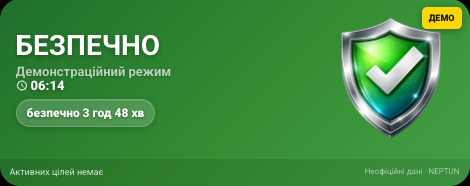
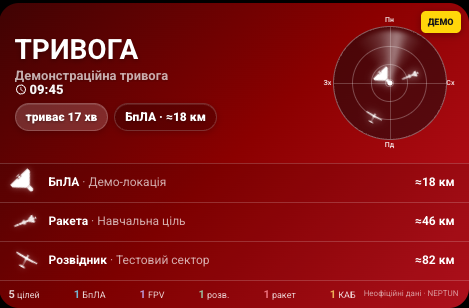
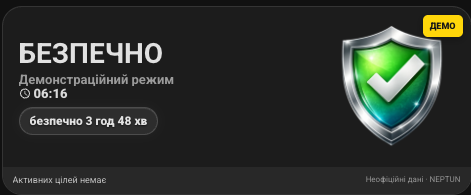
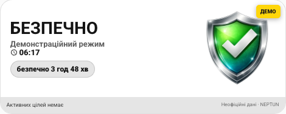
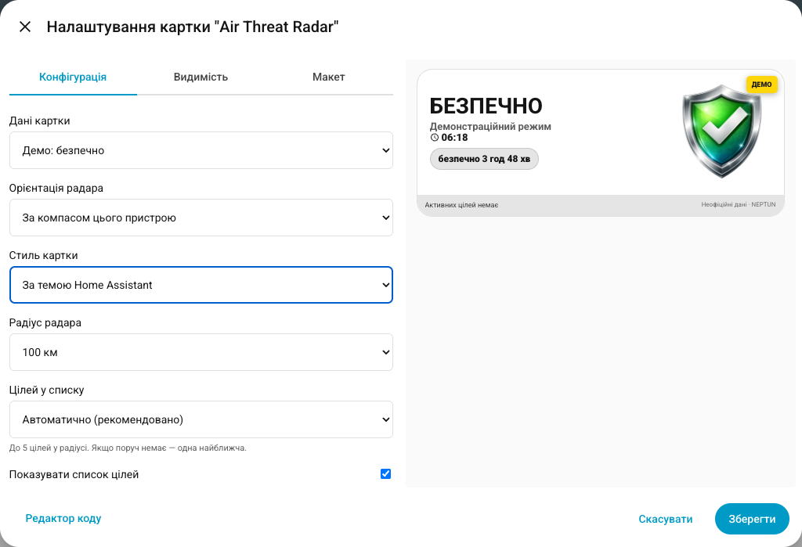

# Air Threat Monitor for Home Assistant

Air Threat Monitor is an independent Home Assistant custom integration that
shows local air-alert status, nearby reported air threats, distances, movement
direction, and a north-up radar card.

> **Informational use only.** This project is not an official
> warning system and must never be the sole source of safety information.
> Always follow official air-alert signals and instructions from Ukrainian
> authorities.

## Features

- Setup entirely through the Home Assistant interface.
- Home Assistant coordinates are prefilled and can be changed before saving.
- Coordinates are processed locally and are not sent to the data provider.
- Local district/oblast air-alert matching with separate yellow warning and
  red alert levels from NEPTUN.
- Distance, bearing, heading, approach state, and target-category calculations.
- Standard north-up radar: north is at the top, east on the right, south at the
  bottom, and west on the left.
- Optional dynamic positioning from the device currently displaying the card,
  or from a selected Home Assistant `person` or `device_tracker` entity.
- Automatic district/oblast label resolved from the same coordinates used for
  dynamic threat calculations.
- Optional device-compass orientation while the card is open on a compatible
  phone.
- Bundled images for safe/alert states and supported target categories.
- Persisted start time and live duration for safe, yellow, and red periods.
- Compact total and per-category target analytics in the radar card.
- Two visual styles: the default green/yellow/red signal design and an optional
  light/dark style that follows the current Home Assistant theme.
- Automatic white/dark target artwork selection for readable target rows in
  both dark and light Home Assistant themes.
- A graphical card editor with live, safe-demo, and alert-demo modes.
- Automatic registration of **Air Threat Radar** in the standard card picker.
- Native Home Assistant More Info dialogs when the alert header, radar,
  target list, or footer analytics are tapped.
- Privacy-safe Home Assistant diagnostics.

## Card styles

| Signal colors | Alert signal | Theme-aware dark | Theme-aware light |
|:---:|:---:|:---:|:---:|
|  |  |  |  |

All screenshots use the built-in demonstration mode. Demo data remains local
to the card, does not change Home Assistant entities, and cannot trigger
automations or notifications.

## Data source and attribution

Threat and alert data is provided by [NEPTUN](https://neptun.in.ua/). NEPTUN is
an informational aggregator; its data may be delayed, incomplete, or
inaccurate.

This is an independent community project. It is not affiliated with, endorsed
by, or supported by NEPTUN. The NEPTUN name and branding belong to their
respective owner and are used only to identify the data source. API use and
attribution details are documented in [NOTICE.md](NOTICE.md).

## Installation with HACS

The GitHub repository must be public before it can be added to HACS as a custom
repository.

1. Open **HACS** in Home Assistant.
2. Open the three-dot menu and choose **Custom repositories**.
3. Enter `https://github.com/serg-ill/air-threat-monitor` and select
   **Integration** as the category.
4. Install **Air Threat Monitor**.
5. Restart Home Assistant.
6. Go to **Settings > Devices & services > Add integration**.
7. Search for **Air Threat Monitor**.
8. Check the prefilled coordinates and submit the form.

## Manual installation

1. Download the `air-threat-monitor-*-manual.zip` archive.
2. Extract it into the Home Assistant configuration directory. The resulting
   path must be:
   `/config/custom_components/air_threat_monitor/manifest.json`.
3. Restart Home Assistant.
4. Add **Air Threat Monitor** from **Settings > Devices & services**.

For the standard setup, no files need to be copied to `/config/www` and no
dashboard resource needs to be registered manually.

## Adding the radar card

1. Open a dashboard and select **Edit dashboard**.
2. Select **Add card**.
3. Choose **Air Threat Radar** from the card picker.
4. Select the monitored location in the graphical editor. If only one location
   exists, it is selected automatically.
5. Choose the position source. **Fixed location** uses the integration
   coordinates. **Live GPS of this device** uses the current viewing phone or
   tablet, so the same shared card can show different results on different
   devices. **Home Assistant person or tracker** follows the selected `person`
   or `device_tracker` regardless of who opens the card.
6. Choose **North up** or **Follow this device compass**. Compass access may
   require tapping the compass button on the card and approving the browser or
   Companion App permission. The control remains in a waiting state until the
   first real heading arrives and becomes actionable again if the device sends
   no compass data.
7. Choose **Signal colors** for the green/yellow/red card or **Follow Home
   Assistant theme** for a neutral light/dark card.
8. Choose the radar radius, number of target rows, and whether the target list
   is visible. The radius affects radar marks only; the list can also show
   reported targets outside that radius.



The card uses live integration data by default. No YAML or entity IDs are
required.

Tap the alert heading or its time to open the air-alert entity. Tap the radar
or nearest-target badge to open the nearest-threat entity. Tap the target list
or footer counters to open the active-target analytics entity. These actions
use the current Home Assistant entity registry and continue to work if the
entities were renamed.

### Custom local status images

The public card uses the bundled standard safe and alert shields. You can
replace the large status illustration with images that you own without adding
them to the integration or sharing them with the data provider.

1. Create `/config/www/air-threat-custom/` in Home Assistant.
2. Copy two PNG, WebP, or JPG files into that directory, for example
   `safe.png` and `danger.png`.
3. Open the card editor and select **Show code editor**.
4. Add these three options to the existing card configuration:

```yaml
artwork_style: custom
safe_image: /local/air-threat-custom/safe.png
danger_image: /local/air-threat-custom/danger.png
```

`/local/` maps to Home Assistant's `/config/www/` directory. The custom option
is intentionally configured through YAML and is not displayed in the graphical
card editor. If either URL is empty or invalid, the card falls back to the
standard bundled shield. During an active alert with nearby targets, the radar
remains the main visual; the custom alert image is shown when the radar has no
matching target to display.

> **Recommended setup order for live GPS and compass:** first add and configure
> the card from the official Home Assistant Companion App on the phone that
> will use these features. When prompted, allow precise location and
> motion/orientation access. If the card is configured first from a desktop or
> kiosk, the mobile permission request may not appear until the card is opened
> and enabled again from the Companion App. Permissions are granted separately
> on every phone or browser. On a device without GPS or a compass, the card
> automatically disables unsupported controls and keeps the available fixed or
> Home Assistant tracker behavior.

### Family members and mobile positioning

Use **Live GPS of this device** when one shared card should adapt automatically
to the phone or tablet on which it is opened. With location permission granted,
three family phones can display three different distances and bearings from the
same dashboard configuration.

Use **Home Assistant person or tracker** when the card must always follow one
specific family member. Create separate card instances and select the
corresponding `person` or `device_tracker` in each one. The card sends only the
selected entity ID; Home Assistant reads its current coordinates and performs
the calculation on the server for every refresh. If the Home Assistant
Companion App provides a Geocoded Location sensor on that tracker's device, the
card automatically displays its city, town, or village. Otherwise, it falls
back to the district or oblast resolved from the same coordinates. The place
cannot be overridden with an unrelated sensor.

The optional compass is different: it is read locally from the device currently
displaying the card. Select **Follow this device compass**, then tap **Enable
compass** on the card and approve the permission in the official Companion App.
For the most predictable first-run permission flow, perform this setup from the
Companion App rather than a desktop or kiosk. Demo mode also supports this test.
The compass rotates only the visual radar layer; provider data, distance
calculations, entities, and automations remain north-referenced. Browser motion
sensors require a secure context. The Home Assistant Cloud remote URL provides
HTTPS; a local `http://` address may leave the compass unavailable in the
Companion App or browser.

For a newly opened dynamic safe card, the provider does not expose when that
location last became safe. The card therefore leaves the safe start time and
duration blank instead of inventing a value. It starts a local duration after
observing a real alert-state transition while the card is open. Active alerts
continue to use the provider timestamp when it is available.

Dynamic accuracy depends on location updates supplied by the browser,
Companion App, phone, and operating system. If the current device or selected
tracker has no valid coordinates, the card shows an explicit unavailable
message instead of silently using another person's or an old configured
position. Browser and Companion App permissions may be required. North-up mode
remains available on all devices.

## Safe testing

In the card editor, change **Card data** to one of these modes:

- **Demo: safe** displays the bundled safe state.
- **Demo: yellow level** displays the warning state without waiting for a live
  yellow alert in the selected area.
- **Demo: alert** displays sample targets and radar movement.
- **Live data** returns to the integration snapshot.

Demo mode is local to that card. It does not modify Home Assistant entities,
run automations, or send notifications. A visible **DEMO** label remains on the
card while test data is active.

## Entities

- **Air alert**: local district/oblast alert state.
- **Nearest threat**: nearest active target distance with direction, heading,
  approach, and type attributes.
- **Reported targets**: active target count with category and distance-band
  analytics. Provider records marked stale or resolved are excluded so every
  displayed count describes the current active target list.

Large target lists are kept out of entity attributes and Home Assistant
Recorder. The bundled card obtains a compact processed snapshot over the Home
Assistant WebSocket API.

## Privacy

- Exact configured coordinates remain inside Home Assistant.
- In tracker mode, only the selected Home Assistant entity ID is sent by the
  frontend. Its coordinates are read and processed inside Home Assistant.
- In this-device mode, browser coordinates are sent only to the integration's
  local WebSocket handler for calculations.
- Diagnostics redact latitude and longitude.
- Diagnostics do not contain exact target coordinates or the raw target list.
- The card receives calculated bearings and distances, not the configured home
  coordinates.

## Updating

- HACS installations can update from the HACS integration page when a new
  release is published.
- Manual installations must replace the existing
  `/config/custom_components/air_threat_monitor` directory with the directory
  from the new archive, followed by a Home Assistant restart. Delete or rename
  the old directory before extracting the replacement; extracting over it may
  leave obsolete files from an earlier release.

## Troubleshooting

### The integration does not appear

- Confirm that `manifest.json` is directly inside
  `/config/custom_components/air_threat_monitor/`.
- Restart Home Assistant, then refresh the browser.
- Check **Settings > System > Logs** for `air_threat_monitor` errors.

### The card does not appear in Add card

- Confirm that the integration is loaded successfully.
- Open **Settings > Dashboards > Resources** and confirm that
  `/air_threat_monitor/assets/air-threat-radar-card.js` is registered as a
  JavaScript module. It is created automatically when Lovelace uses its default
  storage mode.
- Hard-refresh the browser or clear the Home Assistant frontend cache.
- Restart the Home Assistant mobile app if it was open during installation.

### Location validation fails

- Check internet access from the Home Assistant host.
- Verify the coordinates and try again.
- The location must match an area available in the provider boundary data.

### Data appears stale or incomplete

When the provider response is unavailable or malformed, the card displays an
explicit **Data unavailable** state instead of presenting old data as current.
Only targets that the provider currently marks as `active` are displayed and
counted. The integration cannot improve missing or delayed source data. Verify
the current situation using official warning channels.

## Removing the integration

1. Remove the Air Threat Radar cards from dashboards.
2. Delete the Air Threat Monitor entry from **Settings > Devices & services**.
3. Uninstall it in HACS, or remove
   `/config/custom_components/air_threat_monitor` for a manual installation.
4. Restart Home Assistant.

## Development

```bash
pip install -r requirements_test.txt
ruff check .
pytest
python scripts/build_release.py
```

The release builder creates a HACS archive, a manual-install archive, and a
SHA-256 checksum file in `dist/`.
